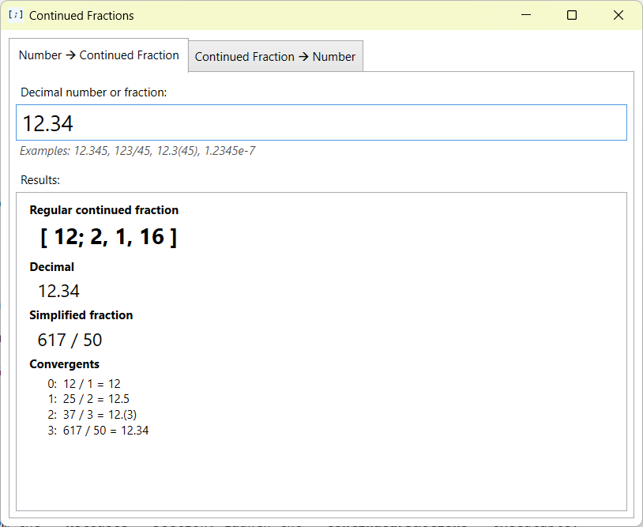
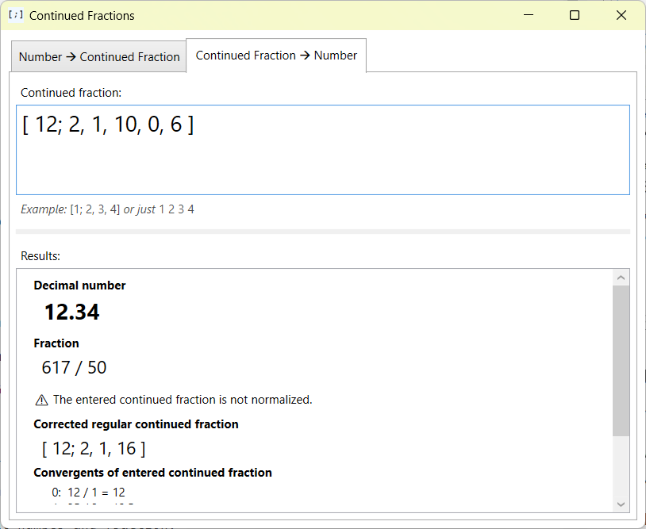

# Continued Fractions

An experimental tool that converts decimal numbers and fractions to continued fractions, and vice versa.
The program also displays the convergents, and converts the simple continued fractions to regular ones.

For example:

Entered number   | The result
:---             | :--- 
12.34		     | [ 12; 2, 1, 16 ]
5/6              | [ 0; 1, 5 ]
0.8(3)           | [ 0; 1, 5 ]

Entered continued fraction | The result 
:---                | :--- 
[ 12; 2, 1, 16 ]    | 12.34
[ 0; 1, 5 ]         | 0.8(3)

The program accepts various kinds of numbers:

Input               | Meaning
:---                | :--- 
123                 | Integer number
12.34               | Decimal number
0.8(3)              | Repeating (recurring) decimal
5/6                 | Fraction
1.2e&#x2011;7       | Scientific notation (1.2×10&#x207B;&#x2077;)
pi | Number &#x03C0; (3.1415926&#x2026;)
e | Euler's (Napier's) number (2.7182818&#x2026;)

### Screenshots

Converting a decimal number or fraction to regular continued fraction:

Converting a simple continued fraction to decimal number and fraction. The output also
includes the corrected regular continued fraction:

### Usage

The program runs in this environment:

* Windows 11 or Windows 10 (64-bit),
* .NET 9.

To use it, download and unzip the latest archive from the **Releases** section. Launch the **ContinuedFractions** executable.

Alternatively, the source files, which are got from the **Releases** section too, can be compiled in Visual Studio 2022
that includes the “.NET desktop development” workload. The program is made in C#, WPF.

### References

* Dr Ron Knott, *An introduction to Continued Fractions* — https://r-knott.surrey.ac.uk/Fibonacci/cfINTRO.html
* Conrad, K\., *Negation and Inversion of Continued Fractions* — https://kconrad.math.uconn.edu/blurbs/ugradnumthy/contfrac-neg-invert.pdf
